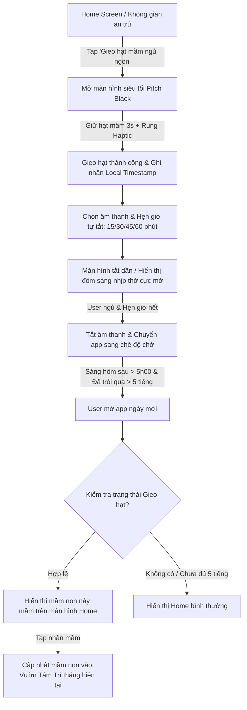

# Product Backlog Item (PBI): Hạt mầm ngủ ngon (Sound Sleep Seed)

## 📌 Thông tin ticket

| Trường | Giá trị |
| :--- | :--- |
| **Project** | ANAM |
| **Type** | Story |
| **Priority** | High |
| **Label** | feature, sleep, zen-ux, psychology |
| **Epic** | Không gian an trú |

---

## 🧭 User Story

**As an** lữ khách gặp khó khăn trong việc giải tỏa căng thẳng và dập tắt những suy nghĩ hỗn loạn (overthinking) trước khi đi ngủ,  
**I want** gieo một "hạt mầm ngủ ngon" thông qua trải nghiệm buông bỏ dịu nhẹ và tắt màn hình mà không bị áp lực bởi các chỉ số đo lường giấc ngủ,  
**So that** tôi có thể chìm vào giấc ngủ tự nhiên bằng sự tin tưởng và đón nhận một mầm xanh bình yên vào sáng hôm sau.

---

## 🎯 Goals

*   **[Chuyển tiếp trạng thái]**: Thiết lập một nghi thức chuyển tiếp (transition ritual) trước giờ đi ngủ, kích hoạt hệ thần kinh phó giao cảm (parasympathetic nervous system) qua hơi thở và âm thanh.
*   **[Triết lý phi lượng hóa]**: Loại bỏ hoàn toàn sự lo âu về giấc ngủ (Orthosomnia) bằng cách không đo đạc thời gian ngủ sâu, không chấm điểm giấc ngủ, không tạo áp lực streak.
*   **[Trải nghiệm Dark UI tối đa]**: Thiết kế giao diện siêu tối (Pitch Black / Midnight Blue) với độ sáng tối thiểu để tránh kích thích võng mạc, hỗ trợ sản sinh Melatonin tự nhiên.
*   **[Đồng bộ hóa Vườn Tâm Trí]**: Tích hợp mầm cây ngủ ngon (Sleep Sprout) nảy mầm sau giấc ngủ vào cơ sở dữ liệu và hiển thị trực quan trong Vườn Tâm Trí của tháng.

---

## 🧠 Bối cảnh tâm lý học (Tại sao cần tính năng này)

Theo triết lý **Chủ nghĩa Nội sinh (Endogenism)** và tâm lý học tự chăm sóc bản thân thế tục (Secular self-care):
1.  **Chống lại Orthosomnia (Ám ảnh giấc ngủ hoàn hảo)**: Các ứng dụng theo dõi giấc ngủ hiện đại (Apple Health, Whoop, Sleep Cycle) liên tục lượng hóa giấc ngủ bằng điểm số (e.g., "Sleep Score: 68/100"). Việc này vô tình tạo ra áp lực bên ngoài (exogenous pressure), khiến người dùng lo lắng về việc "phải ngủ tốt", dẫn đến tình trạng mất ngủ thứ phát do lo âu. ANAM coi giấc ngủ là một tiến trình tự nhiên, phi hành vi và phi hiệu suất. Việc gieo hạt mầm là một hành động tượng trưng cho sự "buông bỏ quyền kiểm soát" (Surrender of control) — người dùng chỉ gieo hạt, phần còn lại hãy để tự nhiên dẫn dắt.
2.  **Định luật Non-doing (Vô vi)**: Giấc ngủ không thể đạt được bằng cách "cố gắng". Tính năng này được thiết kế để người dùng tương tác tối thiểu. Thay vì vuốt chạm liên tục, người dùng chỉ cần giữ ngón tay trên màn hình trong 3 giây để gieo hạt, sau đó úp điện thoại xuống. Âm thanh ambient tần số thấp (tiếng mưa rơi trên lá chuối, tiếng bếp lửa lách tách, tiếng chuông gió thiền) sẽ tự tắt, giúp tâm trí chuyển dịch từ vùng tư duy logic sang vùng cảm nhận giác quan đơn thuần.
3.  **Mầm cây phục hồi**: Sáng hôm sau, chiếc mầm xanh nhỏ nảy lên không đại diện cho chất lượng giấc ngủ nông hay sâu, mà đại diện cho **sự dũng cảm dám ngắt kết nối** để nghỉ ngơi của họ vào đêm hôm trước.

---

## 🗺️ Luồng hoạt động (System Flow)

---

## 📐 Chi tiết Thích Ứng / Yêu Cầu Chức Năng

### 1. Phân hệ Quản lý trạng thái hạt mầm (`SleepSeedRepository` & BLoC)
*   **Trạng thái cơ sở dữ liệu (`SleepSeedModel`)**:
    *   `sownAt`: DateTime (thời điểm gieo hạt).
    *   `sproutedAt`: DateTime (thời điểm nhận mầm vào sáng hôm sau).
    *   `status`: Enum (`idle` - chưa gieo, `sown` - đã gieo và đang ngủ, `sprouted` - đã nảy mầm chờ nhận, `collected` - đã nhận vào vườn).
    *   `soundSelection`: String (id của âm thanh ambient được chọn gần nhất).
    *   `timerDuration`: Int (thời gian hẹn giờ, tính bằng phút).
*   **Lưu trữ local-first**: Lưu thông tin trạng thái giấc ngủ vào `SharedPreferences` để đảm bảo tính tức thời ngoại tuyến. Khi có kết nối mạng, đồng bộ thông tin hạt mầm đã gieo lên subcollection `sleep_seeds` của Firebase để đồng nhất thiết bị.

### 2. Giao diện gieo hạt đêm (`SleepSowView`)
*   **Aesthetics**: 
    *   Nền đen tuyệt đối (`Color(0xFF08080C)`) phối hợp chuyển sắc tuyến tính cực nhẹ sang xanh Midnight (`Color(0xFF0F1020)`).
    *   Không sử dụng các nút viền sắc cạnh hay ánh sáng chói. Mọi nút điều khiển đều có độ đục (opacity) thấp (0.4 - 0.6) để bảo vệ mắt ban đêm.
*   **Tương tác gieo hạt**:
    *   Một hạt mầm dạng nét vẽ Line-art phát sáng mờ ảo ở tâm màn hình.
    *   User chạm giữ (`GestureDetector.onLongPressStart`) trong 3 giây. Trong quá trình giữ, hạt mầm to dần kèm theo hiệu ứng rung haptic nhẹ tăng dần theo tần số tim (`HapticFeedback.lightImpact` liên tục).
    *   Khi gieo thành công, phát haptic mạnh hơn một chút (`HapticFeedback.mediumImpact`) và hạt mầm chìm vào đất cát trừu tượng.

### 3. Trình phát âm thanh & Nhịp thở định tâm ban đêm
*   **Âm thanh tích hợp (chạy local offline)**:
    *   *Tiếng mưa Anam*: Tiếng mưa rơi đều đặn trên mái tranh.
    *   *Bếp lửa an trú*: Tiếng lửa lách tách ấm áp.
    *   *Gió ngàn*: Tiếng gió rì rào qua rừng thông.
    *   *Sóng lặng*: Tiếng sóng biển vỗ bờ xa xăm.
*   **Hẹn giờ tắt (Sleep Timer)**: 15, 30, 45, 60 phút. Khi hết giờ, âm thanh sẽ fade-out (giảm âm lượng tuyến tính về 0 trong vòng 10 giây) để tránh làm thức giấc người dùng do thay đổi âm lượng đột ngột.
*   **Đốm sáng thở (Breathing Dot)**: Hiển thị một đốm sáng tròn mờ ảo co giãn theo nhịp thở 4-7-8 (Hít vào 4 giây, giữ 7 giây, thở ra 8 giây) để dẫn dắt mắt người dùng dịu lại.

### 4. Giao diện nhận mầm sáng hôm sau (`MorningSproutView`)
*   Nếu trạng thái hạt mầm là `sprouted` (khi kiểm tra thấy thời gian hiện tại đã qua 5h sáng và cách thời điểm gieo ít nhất 5 tiếng):
    *   Khi người dùng mở ứng dụng, màn hình Home sẽ hiển thị một chiếc bình thủy tinh mờ bên trong chứa một mầm cây nhỏ xanh non đang tỏa ra các đốm sáng sinh mệnh yếu ớt.
    *   Lời dẫn dắt ấm áp: *"Chào bạn. Hạt mầm bình yên bạn gieo đêm qua đã nảy mầm trong tĩnh lặng. Hãy chạm nhẹ để đưa chiếc mầm này vào Vườn Tâm Trí của bạn."*
    *   Khi chạm nhận, mầm cây biến mất bằng hiệu ứng thu nhỏ hạt phấn sáng, trạng thái chuyển sang `collected`, và một biểu tượng mầm non `🌱` nhỏ sẽ xuất hiện trong ngày tương ứng trên Vườn Tâm Trí.

---

## ⚙️ Behavior Rules

*   **BR-1: Giờ giới nghiêm gieo hạt**: Hạt mầm ngủ ngon chỉ có thể được gieo từ `21h00` tối hôm trước đến `04h59` sáng hôm sau. Ngoài khung giờ này, tính năng gieo hạt sẽ ở trạng thái chờ và hiển thị thông điệp: *"Hạt mầm ngủ ngon cần bóng tối của màn đêm để gieo xuống. Hãy quay lại khi đêm về."*
*   **BR-2: Điều kiện nảy mầm hợp lệ**: Để hạt mầm nảy mầm thành công, khoảng cách từ lúc gieo (`sownAt`) đến lúc mở app buổi sáng phải tối thiểu là 5 tiếng.
    *   Nếu người dùng mở app trước 5 tiếng kể từ lúc gieo, hệ thống vẫn giữ trạng thái `sown`, không hiển thị thông báo nảy mầm để khuyến khích người dùng tiếp tục nghỉ ngơi.
    *   Nếu quá 24 tiếng kể từ lúc gieo mà người dùng không mở app hoặc không kích hoạt nhận mầm, hạt mầm tự động chuyển sang trạng thái "Hạt mầm ẩn mình" (không bị mất đi nhưng sẽ được tích lũy âm thầm vào đất vườn mà không hiển thị màn hình chúc mừng rầm rộ).
*   **BR-3: Không làm phiền (Zero Intrusive)**: Tuyệt đối không gửi thông báo đẩy (push notification) giục giã gieo hạt hay nhắc nhở gieo hạt. Mọi hành động gieo hạt phải xuất phát từ nhu cầu nội tại của lữ khách.

---

## ✅ Acceptance Criteria

*   **AC-1: Trải nghiệm tương tác gieo hạt ban đêm**
    *   **Given** Lữ khách đang ở màn hình Home vào lúc 22h00 đêm và chưa gieo hạt mầm.
    *   **When** Lữ khách nhấn vào card "Hạt mầm ngủ ngon" và thực hiện nhấn giữ vào biểu tượng hạt mầm trên màn hình trong 3 giây.
    *   **Then** Hệ thống kích hoạt rung phản hồi xúc giác nhẹ theo nhịp, chuyển đổi trạng thái sang `sown`, lưu mốc thời gian xuống local storage và bắt đầu phát âm thanh ambient đã chọn cùng bộ đếm lùi.
*   **AC-2: Nảy mầm vào sáng hôm sau**
    *   **Given** Lữ khách đã gieo hạt thành công vào lúc 23h00 đêm qua (trạng thái `sown`).
    *   **When** Lữ khách mở ứng dụng vào lúc 07h00 sáng hôm sau (đã qua 8 tiếng, sau 5h00 sáng).
    *   **Then** Hệ thống tự động hiển thị màn hình chúc mừng `MorningSproutView` mờ ảo, mời gọi người dùng nhận mầm xanh non `🌱` để tích hợp vào Vườn Tâm Trí.
*   **AC-3: Xử lý gieo hạt không đủ thời gian**
    *   **Given** Lữ khách gieo hạt ngủ ngon vào lúc 02h00 sáng (trạng thái `sown`).
    *   **When** Lữ khách mở ứng dụng vào lúc 06h00 sáng cùng ngày (mới trôi qua 4 tiếng).
    *   **Then** Hệ thống hiển thị giao diện trang chủ bình thường, không kích hoạt màn hình nảy mầm `MorningSproutView`, trạng thái hạt mầm vẫn là `sown` cho đến khi đủ điều kiện hoặc quá hạn.

---

## 🚫 Out of Scope

*   Không tích hợp các thuật toán AI phân tích giấc ngủ qua mic hoặc chuyển động (gia tốc kế) để tránh tiêu tốn pin và tạo cảm giác bị giám sát cho người dùng.
*   Không kết nối hoặc đồng bộ dữ liệu với Apple HealthKit hay Google Fit trong phạm vi ticket này để giữ tính bảo mật và triết lý secular độc lập tối đa.
*   Chưa hỗ trợ tải thêm nhạc từ bên ngoài, chỉ sử dụng kho âm thanh offline được tuyển chọn sẵn trong tài nguyên nội bộ của ứng dụng.
