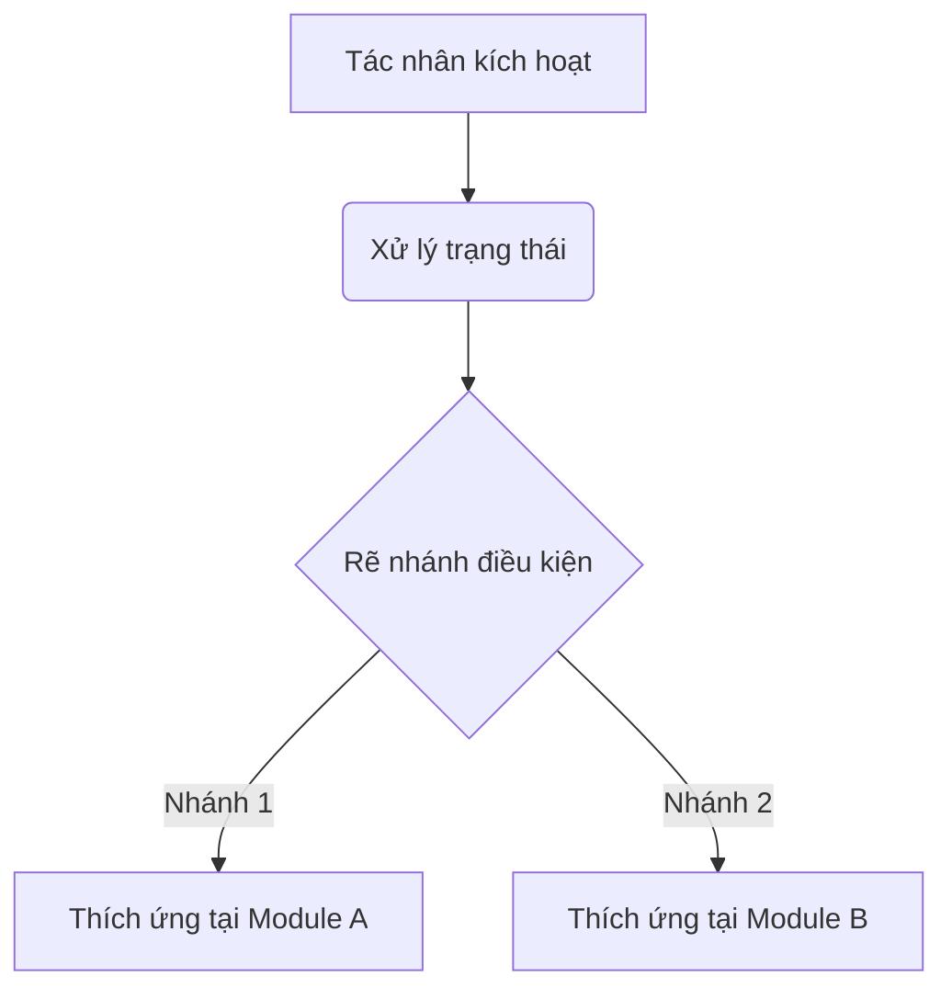

# Product Backlog Item (PBI) Template

## 📌 Thông tin ticket

| Trường | Giá trị |
| :--- | :--- |
| **Project** | [Tên Dự Án (ví dụ: ANAM)] |
| **Type** | [Story / Task / Bug / Spike] |
| **Priority** | [High / Medium / Low / Urgent] |
| **Label** | [tag-1, tag-2, tag-3] |
| **Epic** | [Tên Epic chứa ticket này] |

---

## 🧭 User Story

**As a** [Vai trò người dùng (ví dụ: người dùng sử dụng nhiều tính năng khác nhau)],  
**I want** [Tính năng hoặc hành động mong muốn thực hiện],  
**So that** [Giá trị thực tế hoặc cảm xúc mang lại cho người dùng].

---

## 🎯 Goals

*   **[Mục tiêu 1]**: [Chi tiết về mục tiêu chức năng hoặc phi chức năng cần đạt].
*   **[Mục tiêu 2]**: [Chi tiết về mục tiêu].
*   **[Mục tiêu 3]**: [Chi tiết về mục tiêu].

---

## 🧠 Bối cảnh tâm lý học (Tại sao cần tính năng này)

[Phân tích chiều sâu tâm lý học hành vi hoặc triết lý sản phẩm (ví dụ: Chủ nghĩa Nội sinh - Endogenism, Thuyết Tự Quyết, sự chấp nhận không phán xét). Nêu bật sự khác biệt so với các sản phẩm thông thường và lý do tại sao trải nghiệm này giúp xoa dịu tâm trí người dùng].

---

## 🗺️ Luồng hoạt động (System Flow)

---

## 📐 Chi tiết Thích Ứng / Yêu Cầu Chức Năng

### 1. [Tên thành phần hoặc Phân hệ quản lý trạng thái]
*   [Yêu cầu chi tiết về mặt dữ liệu, lưu trữ local-first, memory-state hoặc DB schema].
*   [Bảng ánh xạ trạng thái hoặc ma trận logic nếu có].

### 2. [Tên Phân hệ thích ứng UI/UX 1]
*   [Cách thức thay đổi mặc định, giao diện hoặc nội dung dựa vào trạng thái].

### 3. [Tên Phân hệ thích ứng UI/UX 2]
*   [Cách thức thay đổi mặc định, giao diện hoặc nội dung].

---

## ⚙️ Behavior Rules

*   **BR-1: [Tên Quy Luật 1]**: [Quy luật về độ ưu tiên, cập nhật trạng thái hoặc ghi đè dữ liệu].
*   **BR-2: [Tên Quy Luật 2]**: [Quy luật về thời gian hết hạn của dữ liệu tạm thời, điều kiện tự động reset].
*   **BR-3: [Tên Quy Luật 3]**: [Quy luật về tính tinh tế, không phán xét, không hiển thị pop-up gây gián đoạn].

---

## ✅ Acceptance Criteria

*   **AC-1: [Tiêu chí nghiệm thu 1]**
    *   **Given** [Ngữ cảnh đầu vào hoặc trạng thái hiện tại của hệ thống/người dùng]
    *   **When** [Hành động kích hoạt cụ thể từ phía người dùng hoặc hệ thống]
    *   **Then** [Kết quả phản hồi mong đợi của giao diện, dữ liệu hoặc luồng hoạt động]

*   **AC-2: [Tiêu chí nghiệm thu 2]**
    *   **Given** [Ngữ cảnh đầu vào]
    *   **When** [Hành động kích hoạt]
    *   **Then** [Kết quả phản hồi mong đợi]

*   **AC-3: [Tiêu chí nghiệm thu 3]**
    *   **Given** [Ngữ cảnh đầu vào]
    *   **When** [Hành động kích hoạt]
    *   **Then** [Kết quả phản hồi mong đợi]

---

## 🚫 Out of Scope

*   [Các phần không thực hiện trong phạm vi ticket này để tránh phình to scope (ví dụ: đồng bộ cloud, auto-play không xin phép)].
*   [Các tính năng phức tạp dự kiến dời sang giai đoạn sau].
